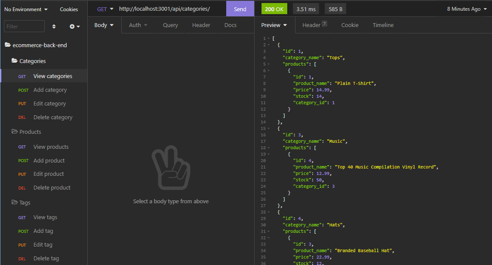

# E-commerce Back-end

This is an e-commerce back-end database that can be used to track inventory of products and the categories and tags they belong to.

Each product belongs to a category of products, and products belonging to each category are returned when `GET` requests to `api/categories` for all categories or `api/categories/#` for the category with the `id` of `#` are made.

Additionally, products can have multiple tags, tags can have multiple products associated with them, thus their associations are handled via the join table model `ProductTags`. When `GET` requests are made to `api/products` for all products or `api/product/#` for a product with the `id` of `#`, its associated categories and tags are also returned in the data object.

Similarly, `GET` requests to `api/tags` and `api/tags/#` show include each tag's associated products.

Finally, categories, products, and tags can each be modified or deleted by id via `PUT` or `DELETE` requests, respectively.

### Video Demo

See a video demonstration [here](https://drive.google.com/file/d/1nhfr0h9dIeG2bF8PWXaIbJ0lNMsXYahj/view?usp=sharing).

---

## Getting Started

These instructions will get you a copy of the project up and running on your local machine for development and testing purposes. 

### Prerequisites

* IDE to view/edit source code (e.g. Visual Studio Code).
* [Node.js](https://nodejs.org/en/)
* [MySQL](https://www.mysql.com/)
* REST API client software (e.g. [Insomnia](https://insomnia.rest/))

### Installing

1. Clone repository.
1. Navigate to `ecommerce-back-end` directory in terminal.
1. `npm install` dependencies.
1. Add MySql user name and password to `.envEXAMPLE` file and change file name to `.env`.
1. Initialize database in SQL with `source db/schema.sql`.
1. If desired, seed database with `npm run seed`.
1. Run with `npm start`.

---

## Built With

* [Sequelize ORM](https://sequelize.org/)
* [MySQL2](https://www.npmjs.com/package/mysql2)
* [Express.js](http://expressjs.com/)
* [Node.js](https://nodejs.org/en/)

## Author

Vince Lee
- [Portfolio](https://starryblue7.github.io/portfolio-ii/)
- [Github](https://github.com/StarryBlue7)
- [LinkedIn](https://www.linkedin.com/in/vince-lee/)

## License

[MIT License](https://vince-lee.mit-license.org/)

## Acknowledgments

* Adapted from seed data & API route structure provided by [UC Berkeley Coding Bootcamp](https://bootcamp.berkeley.edu/coding/).